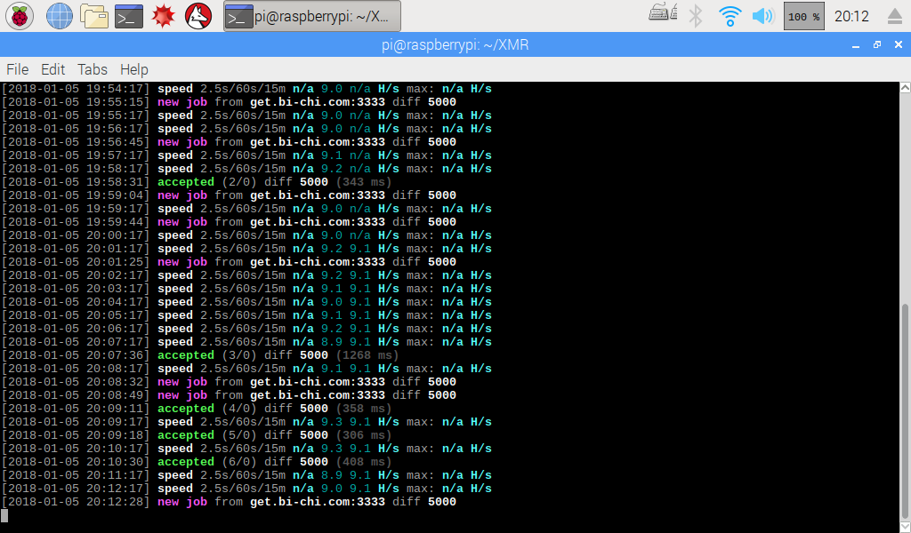
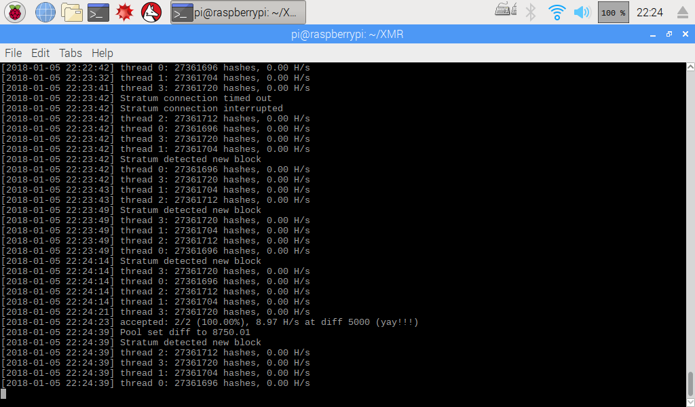

# xmr-miner-executable-for-raspberrypi-3b
可在树莓派3B中官方系统raspbian中运行的门罗币挖矿程序，包括cpuminer-multi和xmrig。<br>
(注：如果单挖门罗币，建议使用xmrig，因为它具有更高的效率和提交结果成功率。但是cpuminer-multi支持多种算法，因此不仅仅可以挖门罗币这一种货币)<br>
(参考结果：xmrig最高可达9.5H/s，cpuminer-multi最高可达8.9H/s)<br>
<br>

<br>

<br>
<br>

示例代码:

cpuminer-multi

```
#假设cpuminer的可执行文件minerd在当前目录，且已经设定执行权限。
./minerd -a cryptonight -o stratum+tcp://get.bi-chi.com:3333 -u 42Ksdz1Po7wZC8W34X8bmX6fk8HED29K36H7rNuxa3GqAK8YDW4tVeSfyubwR4qxehPY8C2VG9VgBSrRJhNfLD9V6ZuRr1f -p x -t 4
```

xmrig(config.json)

如果xmrig不能动作，执行

```
sudo apt install libuv1
```
源：<br>
https://github.com/xmrig/xmrig<br>
https://github.com/lucasjones/cpuminer-multi
